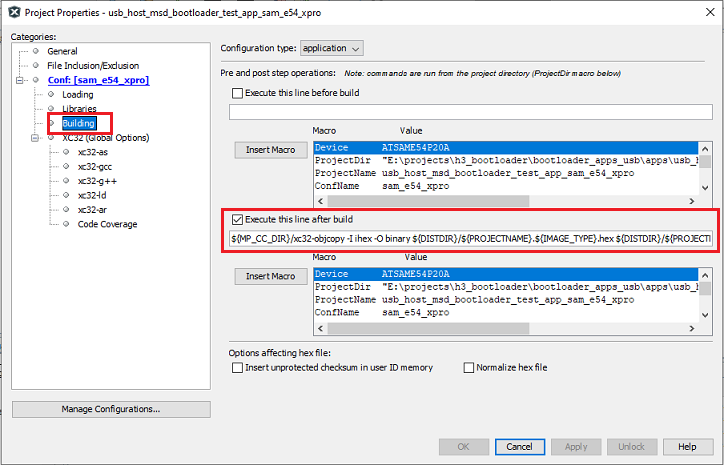

[](https://www.microchip.com)

# Configuring an application to be bootloaded for CORTEX-M based MCUs

## Application settings in MHC system configuration

1. Launch MHC for the application project to be configured
2. Select **system** component from the project graph and configure the below highlighted settings

    <p align="center">
        
    </p>

3. **Disable Fuse Settings:**
    - Fuse settings needs to be disabled for the application which will be boot-loaded as the fuse settings are supposed to be programmed through programming tool from bootloader code. Also the fuse settings are not programmable through firmware

    - Enabling the fuse settings also increases the size of the binary when generated through the hex file

4. **Specify the Application Start Address:**
    - Specify the Start address from where the application will run under the **Application Start Address (Hex)** option in System block in MHC.

    - This value should be equal to or greater than the bootloader size and must be aligned to the erase unit size on that device.

    - As this value will be used by bootloader to Jump to application at device reset it should match the value provided to bootloader code

    - The **Application Start Address (Hex)** will be used to generate XC32 compiler settings to place the code at intended address

    - After the project is regenerated, the ROM_ORIGIN and ROM_LENGTH are the XC32 linker variables which will be overridden with value provided for **Application Start Address (Hex)** and can be verified under Options for xc32-ld in Project Properties in MPLABX IDE as shown below.

    <p align="center">
        
    </p>

## MPLAB X Settings

### For Bootloading the application using USB Host MSD Bootloader

- Specifying post build option to automatically generate the binary file from hex file once the build is complete

    ```
${MP_CC_DIR}/xc32-objcopy -I ihex -O binary ${DISTDIR}/${PROJECTNAME}.${IMAGE_TYPE}.hex ${DISTDIR}/${PROJECTNAME}.${IMAGE_TYPE}.bin
    ```

    

### For Bootloading the application using USB Device HID Bootloader

- Check the **Normalize hex file** option as shown below, as the **Unified bootloader host application** takes hex file as an input. **Normalizing the hex file will make sure the data in the hex file is arranged sequentially**

    <p align="center">
        
    </p>

## Additional settings (Optional)

- **RAM_ORIGIN** and **RAM_LENGTH** values should be provided for reserving configured bytes from start of RAM to **trigger bootloader from firmware**

- Under Project Properties, expand options for xc32-ld and define the values for **RAM_ORIGIN** and **RAM_LENGTH** under Additional options

- This is optional and can be ignored if not required

    <p align="center">
        
    </p>

