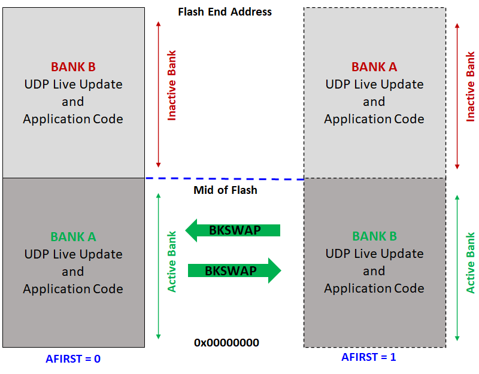

# SAM Live Update Memory Layout

- This layout is applicable only for devices which have Dual bank support (SAMD5x/E5x)

- Internal Flash memory is split into two equal banks **(BANKA and BANKB)**. Special NVM Fuse setting **(AFIRST)** is used to identify which bank is mapped to NVM main address space after reset.

    - Start address of **Active Bank** is always **0x00000000**

    - Start address of **Inactive Bank** is from mid of the Internal flash memory which can vary from device to device. Refer to respective Data sheets for details of Flash memory layout. 

- Live update application start address should always be **(0x00000000 to Mid of Flash)**. Size of the application should not exceed the Mid of flash.

    
