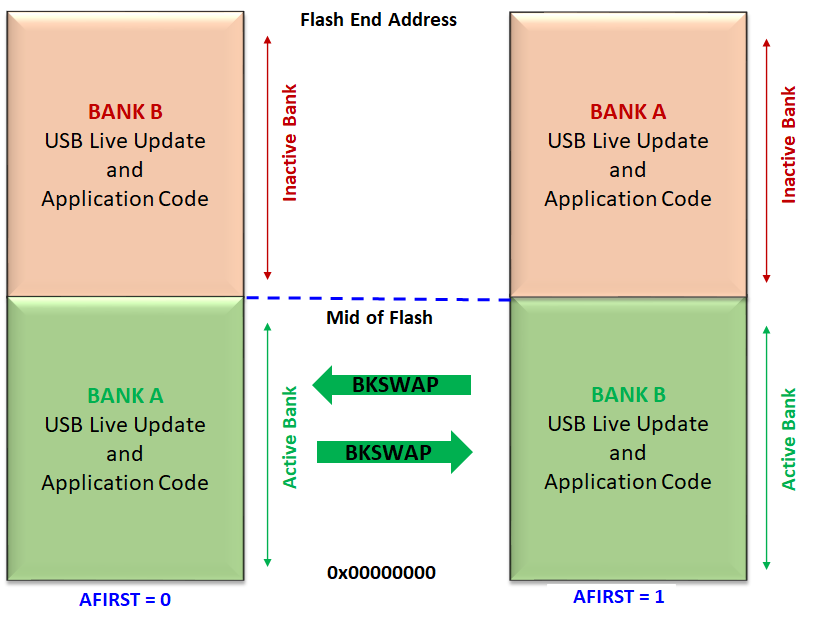

# Live Update Memory layout for CORTEX-M based MCUs

- Supported for the devices which have a Dual Bank flash memory

- Internal Flash memory is split into two equal banks. Special NVM Fuse setting **(AFIRST)** is used to identify which bank is mapped to NVM main address space after reset.

    - Start address of **Active Bank** is always **start of Internal Flash memory**

    - Start address of **Inactive Bank** is from mid of the Internal flash memory which can vary from device to device. Refer to respective Data sheets for details of Flash memory layout.

- Live update application start address should always be **(0x00000000 to Mid of Flash)**. Size of the application should not exceed the Mid of flash.

    

        
    

