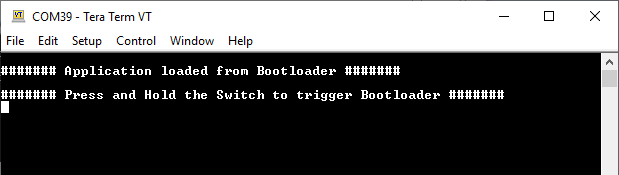
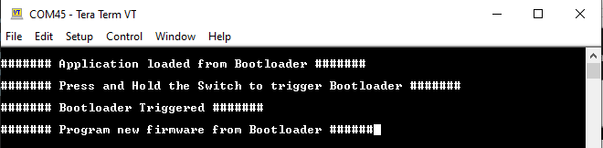

# Building and Running the USB Host MSD Bootloader applications

## Downloading and building the application

To clone or download these application from Github,go to the [main page of this repository](https://github.com/Microchip-MPLAB-Harmony/bootloader_apps_usb) and then click Clone button to clone this repo or download as zip file. This content can also be download using content manager by following [these instructions](https://github.com/Microchip-MPLAB-Harmony/contentmanager/wiki)

Path of the application within the repository is **apps/usb_host_msd_bootloader/**

To build the application, refer to the following table and open the project using its IDE.

### Bootloader Application

| Project Name      | Description                                    |
| ----------------- | ---------------------------------------------- |
| bootloader/firmware/pic32mx470_curiosity.X    | MPLABX Project for [PIC32MX Curiosity Development Board](https://www.microchip.com/Developmenttools/ProductDetails/dm320103)|

### Test Application

| Project Name      | Description                                    |
| ----------------- | ---------------------------------------------- |
| test_app/firmware/pic32mx470_curiosity.X    | MPLABX Project for [PIC32MX Curiosity Development Board](https://www.microchip.com/Developmenttools/ProductDetails/dm320103)|

## Setting up [PIC32MX Curiosity Development Board](https://www.microchip.com/Developmenttools/ProductDetails/dm320103)

- Install an [USB UART click](https://www.mikroe.com/usb-uart-click) board on to the mikroBUS socket J5
- Connect mini USB cable to the [USB UART click](https://www.mikroe.com/usb-uart-click) board. This will enumerate the USB to UART port
    - Note: Ensure that the series resistors on the mikroBUS headers are of value 0 Ohms
- For programming, Connect mini USB cable to the 'Debug USB' connector(J3) on the board to the computer
    - **Do not connect the mini USB cable to a USB Hub**
- Use the USB micro-B port J12 to connect the USB Device to the USB Host
    - A USB micro AB to type A USB Host receptacle converter will be needed to connect the type A USB Flash Drive to the device
- Jumper J13 must be shorted

## Running the Application

1. Open the test application project *test_app/firmware/pic32mx470_curiosity.X* in the IDE
2. Build the project to generate the binary **(Do not program the binary)**
3. Open the bootloader project *bootloader/firmware/pic32mx470_curiosity.X* in the IDE
4. Build and program the application using the IDE

5. **LED1** will be Turned On once programming is completed and bootloader starts running

6. Open the Terminal application (Ex.:Tera Term) on the computer to get test application messages through UART once bootloaded
7. Configure the serial port settings as follows:
    - Baud : 115200
    - Data : 8 Bits
    - Parity : None
    - Stop : 1 Bit
    - Flow Control : None

8. Copy the generated application binary file to a USB Flash drive from the Host PC
    - *\<harmony3_path\>\bootloader_apps_usb\apps\usb_host_msd_bootloader\test_app\firmware\pic32mx470_curiosity.X\dist\pic32mx470_curiosity\production\pic32mx470_curiosity.X.production.bin*

9. Rename the copied application binary file to **image.bin**

10. Insert the USB Flash Drive with the application binary **image.bin** to the Host connector on the device

11. Once the application is successfully programmed **LED3** should start blinking and you should see below output on the console

    

12. Remove the USB Flash Drive from the Host connector

13. Press and hold the Switch **S1** to trigger Bootloader from test application and you should see below output

    

14. Repeat Steps 10-12 once and jump to Step-15
    - This step is to verify that bootloader is running after triggering bootloader from test application in Step 13

15. **Press and hold** the Switch **S1** and then press MCLR button or Power cycle the device to force trigger bootloader at startup
16. Repeat Steps 10-12 once
    - This step is to verify whether bootloader is triggered by switch press at reset

## Additional Steps (Optional)
- To bootload any other application refer to [Application Configurations](../../docs/readme_configure_application_pic32m.md)

- Once done repeat the applicable steps mentioned in [Running The Application](#running-the-application)
