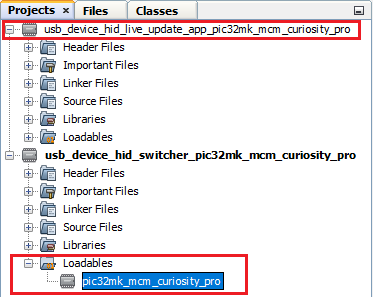
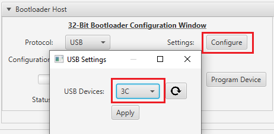
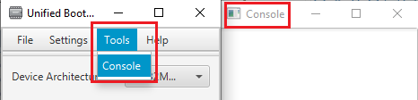
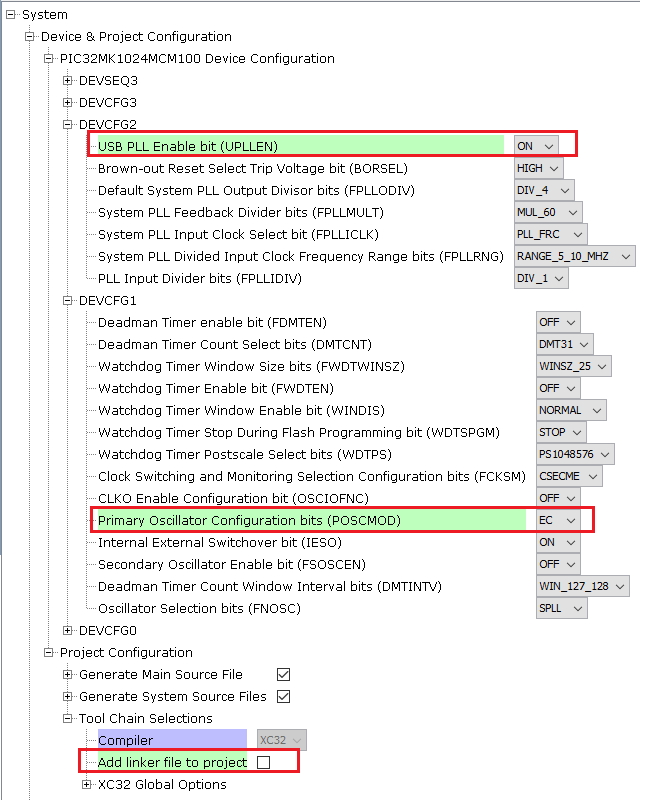
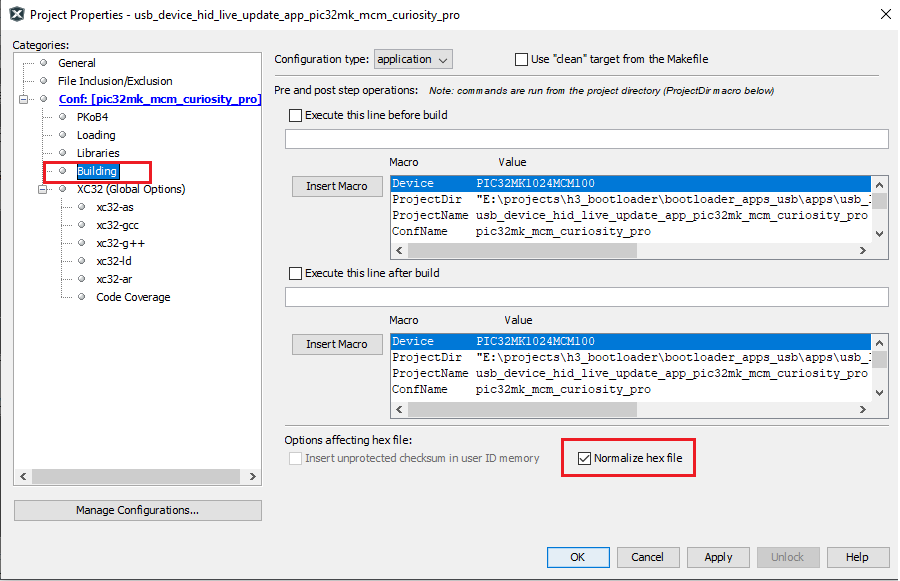

# Building and Running the USB Live Update applications

## Downloading and building the application

To clone or download these application from Github,go to the [main page of this repository](https://github.com/Microchip-MPLAB-Harmony/bootloader_apps_usb) and then click Clone button to clone this repo or download as zip file. This content can also be download using content manager by following [these instructions](https://github.com/Microchip-MPLAB-Harmony/contentmanager/wiki)

Path of the application within the repository is **apps/usb_live_update/**

To build the application, refer to the following table and open the project using its IDE.

### Switcher Application

| Project Name      | Description                                    |
| ----------------- | ---------------------------------------------- |
| switcher/firmware/pic32mk_mcm_curiosity_pro.X    | MPLABX Project for [PIC32MK MCM Curiosity Pro Development Board](https://www.microchip.com/Developmenttools/ProductDetails/EV31E34A) |

### Live Update Application

| Project Name      | Description                                    |
| ----------------- | ---------------------------------------------- |
| live_update_app/firmware/pic32mk_mcm_curiosity_pro.X    | MPLABX Project for [PIC32MK MCM Curiosity Pro Development Board](https://www.microchip.com/Developmenttools/ProductDetails/EV31E34A) |

## Setting up [PIC32MK MCM Curiosity Pro Development Board](https://www.microchip.com/Developmenttools/ProductDetails/EV31E34A)

- Connect a micro USB cable to the USB to UART port J400. This will enumerate as a COM port on the PC

- For programming, Connect a micro USB cable to the USB DEBUG port J500

- Use the micro-AB port J200 (which is located on the bottom side of the board) to connect the USB Device to the USB Host PC

- Place the Switch S200 direction towards Device

## Running the Application

1. Open the switcher application project *switcher/firmware/pic32mk_mcm_curiosity_pro.X* in the IDE

2. Make sure that the *live_update_app/firmware/pic32mk_mcm_curiosity_pro.X* is added as a loadable project to switcher application
    - As the Switcher application does not have any programming capabilities, Adding the **live_update_app as loadable** allows MPLAB X to create a **unified hex file** and program both these application in thier respective memory location based on the respective linker scripts

    

3. Open the Terminal application (Ex.:Tera Term) on the computer to get live update application messages through UART once loaded
4. Configure the serial port settings as follows:
    - Baud : 115200
    - Data : 8 Bits
    - Parity : None
    - Stop : 1 Bit
    - Flow Control : None

5. Build and program the **switcher** application using the IDE

6. **LED3** should start blinking once programming is completed and below message has to be displayed on the Console
    - You can see how the live update application was loaded in BANK 1 by IDE and switcher application jumped BANK 1 to run it
    -  HID Custom device with product ID **3C** will be enumerated on Host PC

    

7. Launch the Unified Host application from below path
    - \<harmony3_path\>/bootloader/tools/UnifiedHost-\*/UnifiedHost-\*.jar

8. Configure the Unified host application
    - Select the **Device architecture** and **Protocol** as shown below

        

    - Click on configure button and select the USB Device as **3C**

        

    - Load the live update application hex file to be programmed using below option
        - *\<harmony3_path\>/bootloader_apps_usb/apps/usb_live_update/live_update_app/firmware/pic32mk_mcm_curiosity_pro.X/dist/pic32mk_mcm_curiosity_pro/production/pic32mk_mcm_curiosity_pro.X.production.hex*

        

    - Open the **Console** window of the host application to view application bootloading sequence

        

9. Click on **Program Device** button to program the loaded live update application hex file on to the device
    - You can note that throughout the programming sequence and after programming the **LED3** will be blinking as the application task is running along with bootloader task **(Live Update Feature)**

    

10. Following snapshot shows output of successfully programming the test application
    - Ignore the Device Reset Messages from the host tool. The live update application ignores the reset command received and waits for a switch press to update serial number and reset

    

11. Press the Switch **SW1** to update serial of **Inactive Bank** and trigger reset. You should see below output on success
    - This step shows that the new firmware programmed in **BANK 2** is running which is mapped to lower region by switcher at reset

    

12. Repeat Steps 9-11 for further updates and observe the Banks from which application is running at every update

## Configurations to be Noted

### Switcher Application

- The USB Live Update application requires the **UPLLEN** Device configuration bit to be set to **ON** and **POSCMOD** Device configuration bit to be set to **EC**. This has to be done in Switcher as the device configuration bits are part of Boot flash memory and can be only programmed by Debugger.
    - The Device configuration bits of the **Live Update Application** will be discarded

- As we are using custom linker script for Switcher, the default linker file generation has to be disabled

### Live Update Application

- Enable Live Update Option to configure USB Device HID bootloader in **Live Update Mode**

- **Normalize hex file:**
    - Check the Normalize hex file option as shown below, as the Unified bootloader host application takes hex file as an input. Normalizing the hex file will make sure the data in the hex file is arranged sequentially.

