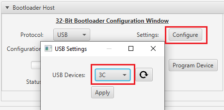

# PIC32MZ Embedded Connectivity with FPU \(EF\) Starter Kit: Building and Running the USB Device HID Bootloader applications

**Parent topic:**[USB Device HID Bootloader](GUID-C3A88DD5-DE20-4FEA-854D-19766CD503A5.md)

## Downloading and building the application

To clone or download these application from Github,go to the [main page of this repository](https://github.com/Microchip-MPLAB-Harmony/bootloader_apps_usb) and then click Clone button to clone this repo or download as zip file. This content can also be download using content manager by following [these instructions](https://github.com/Microchip-MPLAB-Harmony/contentmanager/wiki)

Path of the application within the repository is **apps/usb\_device\_hid\_bootloader/**

To build the application, refer to the following table and open the project using its IDE.

### Bootloader Application

|Project Name|Description|
|------------|-----------|
|bootloader/firmware/pic32mz\_ef\_sk.X|MPLABX Project for [PIC32MZ Embedded Connectivity with FPU \(EF\) Starter Kit](https://www.microchip.com/Developmenttools/ProductDetails/Dm320007)|

### Test Application

|Project Name|Description|
|------------|-----------|
|test\_app/firmware/pic32mz\_ef\_sk.X|MPLABX Project for [PIC32MZ Embedded Connectivity with FPU \(EF\) Starter Kit](https://www.microchip.com/Developmenttools/ProductDetails/Dm320007)|

## Setting up [PIC32MZ Embedded Connectivity with FPU \(EF\) Starter Kit](https://www.microchip.com/Developmenttools/ProductDetails/Dm320007)

-   Connect a mini USB cable to the UART-USB port J11

-   For programming, connect a mini USB cable to the USB Debug port J3

-   Use the micro-A/B port J4 \(which is located on the bottom side of the board\) to connect the USB Device to the USB Host PC

## Running the Application

1.  Open the test application project *test\_app/firmware/pic32mz\_ef\_sk.X* in the IDE

2.  Build the project to generate the binary **\(Do not program the binary\)**

3.  Open the bootloader project *bootloader/firmware/pic32mz\_ef\_sk.X* in the IDE

4.  Build and program the application using the IDE

5.  Once programming is completed and bootloader starts running

    -   **LED1** will be Turned On

    -   HID Custom device with product ID **3C** will be enumerated on Host PC

6.  Open the Terminal application \(Ex.:Tera Term\) on the computer to get test application messages through UART once bootloaded

7.  Configure the serial port settings as follows:

    -   Baud : 115200

    -   Data : 8 Bits

    -   Parity : None

    -   Stop : 1 Bit

    -   Flow Control : None

8.  Launch the Unified Host application from below path

    -   <harmony3\_path\>/bootloader/tools/UnifiedHost-\*/UnifiedHost-\*.jar

9.  Configure the Unified host application

    -   Select the **Device architecture** and **Protocol** as shown below

        

    -   Click on configure button and select the USB Device as **3C**

        

    -   Load the test application hex file to be programmed using below option

        -   *<harmony3\_path\>/bootloader\_apps\_usb/apps/usb\_device\_hid\_bootloader/test\_app/firmware/pic32mz\_ef\_sk.X/dist/pic32mz\_ef\_sk/production/pic32mz\_ef\_sk.X.production.hex*

        

    -   Open the **Console** window of the host application to view application bootloading sequence

        

10. Click on **Program Device** button to program the loaded test application hex file on to the device

    

11. Following snapshot shows output of successfully programming the test application

    

12. If above step is successful then **LED3** should start blinking and you should see below output on the console

    

13. Press and hold the Switch **SW1** to trigger Bootloader from test application and you should see below output

    

14. Repeat Steps 10-12 once and jump to Step-15

    -   This step is to verify that bootloader is running after triggering bootloader from test application in Step 13

15. **Press and hold** the Switch **SW1** and then Power cycle the device to force trigger bootloader at startup

16. Repeat Steps 10-12 once

    -   This step is to verify whether bootloader is triggered by switch press at reset

**Note**

-   Unified Host application has to be closed in order to program any application using MPLAB X IDE

## Additional Steps \(Optional\)

-   To bootload any other application refer to [Application Configurations](GUID-6E96B464-6390-4AD8-A7C5-98AC2758D05F.md)

-   Once done repeat the applicable steps mentioned in [Running The Application](#running-the-application)

